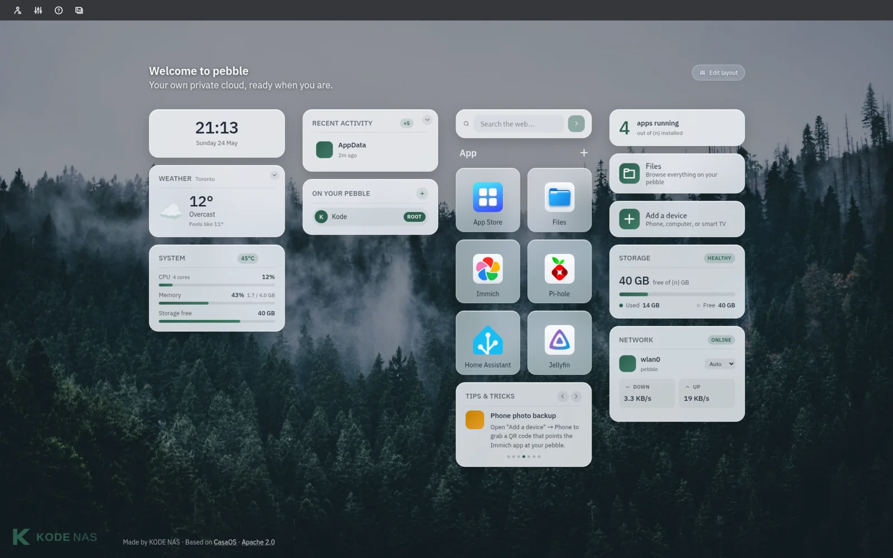

# KODE NAS Docs

Your own private cloud, in a box the size of a paperback. Setup guides, troubleshooting, and reference for KODE OS and the KODE NAS pebble.

<figure class="kode-figure kode-figure--hero" markdown="span">
  { loading=lazy }
  <figcaption>The KODE OS Beginner dashboard — what you'll see when you open your pebble.</figcaption>
</figure>

-   :material-monitor-dashboard:{ .lg .middle } &nbsp;__KODE OS__

    ---

    The operating system that runs your pebble. Install, set up family
    accounts, share files, and find your way around the dashboard.

    [:octicons-arrow-right-24: Open the KODE OS guide](os/index.md)

-   :material-cube-outline:{ .lg .middle } &nbsp;__KODE NAS Pebble__

    ---

    The hardware itself. What's in the box, what's inside, and how to get
    it powered on and on your network for the first time.

    [:octicons-arrow-right-24: Open the pebble guide](pebble/index.md)

## What is KODE NAS?

KODE NAS makes a small home server called the **pebble** — about the size of a
paperback. It stores your photos, your files, and the apps you want to run at
home, with nothing leaving the house unless you ask it to.

The pebble runs **KODE OS**, a friendly operating system built on top of the
open-source [CasaOS](https://github.com/IceWhaleTech/CasaOS) project. You
don't need to be technical to use it: plug it in, follow the five-minute
setup, and you have your own private cloud — no subscription, no telemetry,
no monthly bill.

These docs cover both: the **software** (KODE OS) and the **hardware** (the
pebble itself). If you're new, start with the [pebble unboxing
guide](pebble/unboxing.md). If you've already got one running, the [KODE OS
overview](os/index.md) is the place to go next.
