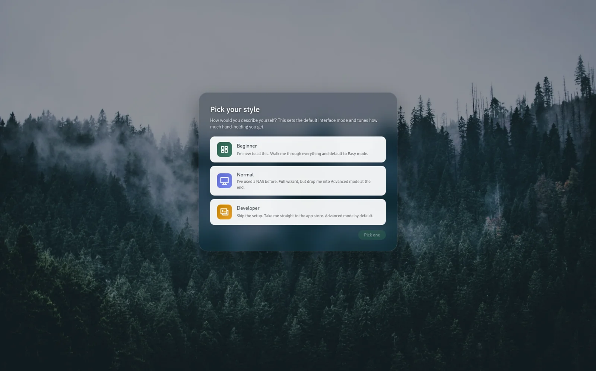
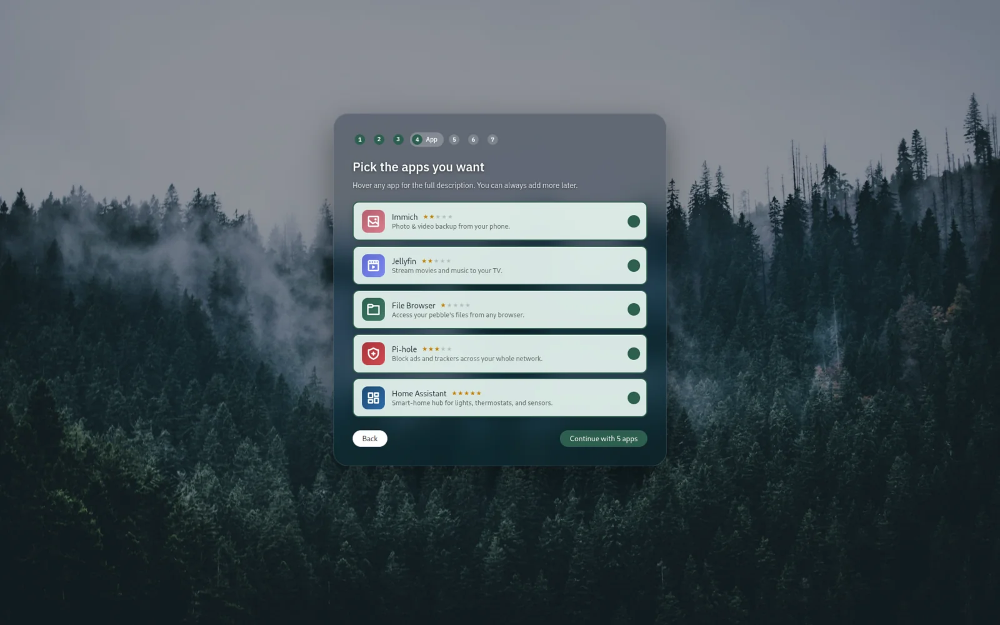
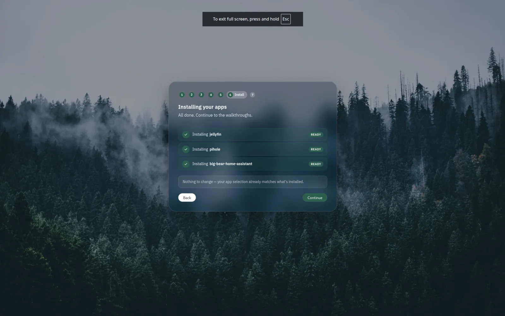

# Installing KODE OS

This page walks you through installing KODE OS on a Raspberry Pi 5. The
flow as of v0.2.0-alpha is **flash an image, boot, open a browser** —
there's no SSH, no installer to run, and no terminal needed.

If you bought a pre-built pebble from KODE NAS you can skip this page —
your pebble already has KODE OS on it. Head to [First boot
setup](first-boot.md).

!!! warning "Alpha software"
    KODE OS is currently **v0.2.0-alpha**. APIs, defaults, and the
    install path will change before v1. Only run it on hardware you
    can reflash.

## What you'll need

- **A Raspberry Pi 5 (4 GB or 8 GB).** Pi 5 is the only board this
  release supports. Pi 4 lands in v0.3.0.
- **A microSD card.** 16 GB or larger. Class 10 / A1 or better — slow
  cards make first-boot painful. An M.2 NVMe via the Pi 5 HAT is a
  great upgrade if you have one.
- **A USB-C power supply.** The official Raspberry Pi 5 power supply
  (5 V / 5 A) is what we recommend. Underpowered supplies cause random
  reboots that are hard to diagnose.
- **An ethernet cable.** Wi-Fi works if you set the credentials in
  Raspberry Pi Imager's customization screen before flashing — but
  ethernet is faster, more reliable, and avoids one whole class of
  first-boot failure modes for v0.2.
- **An SD card reader.** Built into most laptops; otherwise a cheap
  USB one works fine.
- **Another computer.** Mac, Windows, or Linux — anything that can run
  Raspberry Pi Imager.

## How the install works

KODE OS ships as a single flashable image. Inside is:

- **Raspberry Pi OS Lite (64-bit, Bookworm)** as the base.
- **CasaOS** (the OS engine KODE OS extends).
- **The KODE OS dashboard** pre-built and overlaid onto the CasaOS
  web root.
- **The OLED display daemon** for the optional Waveshare 2.08" SH1122
  screen (hardware-gated — it doesn't run if no OLED is wired up).
- **A first-boot service** that runs once on first power-on: expands
  the root filesystem to fill the SD card, waits for real internet,
  bootstraps CasaOS, mints a random wizard URL token, shows the URL
  on the OLED + MOTD, then self-disables.

So the order of operations is: **download image → flash → boot → open
the wizard URL.** No SSH, no `install.sh`, no command line.

## Installation steps

### 1. Download the image

Grab the latest release from
[github.com/KodeNAS/kode-os/releases](https://github.com/KodeNAS/kode-os/releases/latest).
The file you want is named like:

```
kode-os-v0.2.0-alpha-pi5-lite.img.xz
```

About 475 MB compressed (~2.8 GB on the card after Raspberry Pi
Imager decompresses it).

A `.sha256` sidecar lives next to the image. Download both if you want
to verify the file before flashing — see [Verifying the
image](#verifying-the-image) below.

### 2. Flash with Raspberry Pi Imager

Grab Raspberry Pi Imager from the
[Raspberry Pi website](https://www.raspberrypi.com/software/) if you
don't have it.

!!! warning "This will erase everything on the SD card"
    Flashing replaces the entire contents of the card. **Double-check
    you're picking the right card in the imager** — it's easy to pick
    a USB drive or an external disk by mistake.

1. Open Raspberry Pi Imager.
2. **Choose device** → **Raspberry Pi 5**.
3. **Choose OS** → scroll to the bottom → **Use custom** → pick the
   `kode-os-v0.2.0-alpha-pi5-lite.img.xz` you just downloaded.
4. **Choose storage** → your microSD card.
5. **Next**. When asked about OS customisation:
    - If you're using **ethernet**: pick **No, just write**. The image
      already has hostname `pebble`, no usable login, and SSH off by
      default — the wizard creates your admin account.
    - If you're using **Wi-Fi**: click **Edit settings**, set your
      Wi-Fi SSID + password (and country). Leave hostname, username,
      and SSH alone — those are baked into the image.
6. Confirm and wait. Flashing takes 3-7 minutes.

When the imager says it's safe to remove the card, eject it.

### 3. Boot the Pi

1. Slot the microSD card into the underside of your Raspberry Pi.
2. Plug an ethernet cable into your router or switch (or rely on the
   Wi-Fi credentials you set in step 2.5).
3. Plug in the USB-C power supply.

First boot takes **3-5 minutes** while the first-boot service runs.
You'll see (if you have an OLED wired up):

1. **WAITING FOR NETWORK / Plug in Ethernet** — only if internet
   isn't available yet. Plug in the cable and it'll auto-resume.
2. **SETTING UP / Expanding storage / step 1 of 3** — filesystem
   resize.
3. **SETTING UP / Installing CasaOS / step 2 of 3 (~2 min)** —
   downloads + installs the CasaOS runtime over the network.
4. **SETTING UP / Almost done / step 3 of 3** — services starting.
5. **OPEN IN BROWSER / pebble.local / /#/wizard/&lt;token&gt;** — the
   wizard URL is ready.

Without the OLED you'll get to the same place, just without the
real-time progress indication.

### 4. Find the wizard URL

The wizard URL is a random token-protected path so a random LAN visitor
can't race you to admin creation during the open window. You can find
it three ways, in this order of preference:

1. **The OLED** (if wired) shows the full URL in the final
   "OPEN IN BROWSER" frame.
2. **A monitor + keyboard plugged into the Pi** shows the URL in the
   MOTD (the welcome banner printed on the login screen). You don't
   need to log in — just read the banner.
3. **Your router's admin page** — find the device with hostname
   `pebble` and note its IP. Then open `http://<that-ip>/` and the
   router-side auto-redirect will land you on the wizard.

The simplest path that works for almost everyone is just:

```
http://pebble.local/
```

Open that in any browser on the same network. The dashboard
auto-redirects to the wizard URL once the first-boot service finishes.

### 5. Run the welcome wizard

The wizard walks you through:

- Setting an admin password for the dashboard.
- Naming your pebble.
- Adding family member accounts (optional).
- Picking which apps to install — photos, files, media, ad blocker,
  smart home.
- Choosing a dashboard layout.

<div class="grid kode-gallery" markdown>

<figure class="kode-figure" markdown="span">
  { loading=lazy }
  <figcaption>1. Pick a style — Beginner, Normal, or Developer.</figcaption>
</figure>

<figure class="kode-figure" markdown="span">
  { loading=lazy }
  <figcaption>2. Pick the apps you want installed.</figcaption>
</figure>

<figure class="kode-figure" markdown="span">
  { loading=lazy }
  <figcaption>3. Wait while your apps install.</figcaption>
</figure>

</div>

Take your time. None of it is permanent — you can change anything
later from the **Settings** screen.

The wizard is covered in detail on the [First boot setup](first-boot.md)
page.

## Verifying the image

Each release ships a `.sha256` sidecar next to the `.img.xz`. After
downloading both into the same folder:

```bash
sha256sum -c kode-os-v0.2.0-alpha-pi5-lite.img.xz.sha256
```

Expected output:

```
kode-os-v0.2.0-alpha-pi5-lite.img.xz: OK
```

If you see `FAILED` or `WARNING`, your download is incomplete or has
been tampered with — re-download from the release page.

## Next steps

You're done installing. From here:

- [First boot setup](first-boot.md) — what the welcome wizard asks
  for, and why.
- [File sharing (Samba)](samba.md) — connect to your pebble from your
  Mac, Windows PC, or phone.
- [OLED display](oled.md) — if you have the screen accessory,
  customise what it shows.
- [Troubleshooting](troubleshooting.md) — if anything looks wrong.

## Building from source (developers only)

If you'd rather layer KODE OS onto an existing Pi OS Lite install
instead of flashing the image — typically because you're iterating on
the UI — the v0.1.x install script still works:

```bash
git clone https://github.com/KodeNAS/kode-os.git
cd kode-os
sudo ./scripts/install.sh
```

This path is for contributors. Buyers should flash the image.
